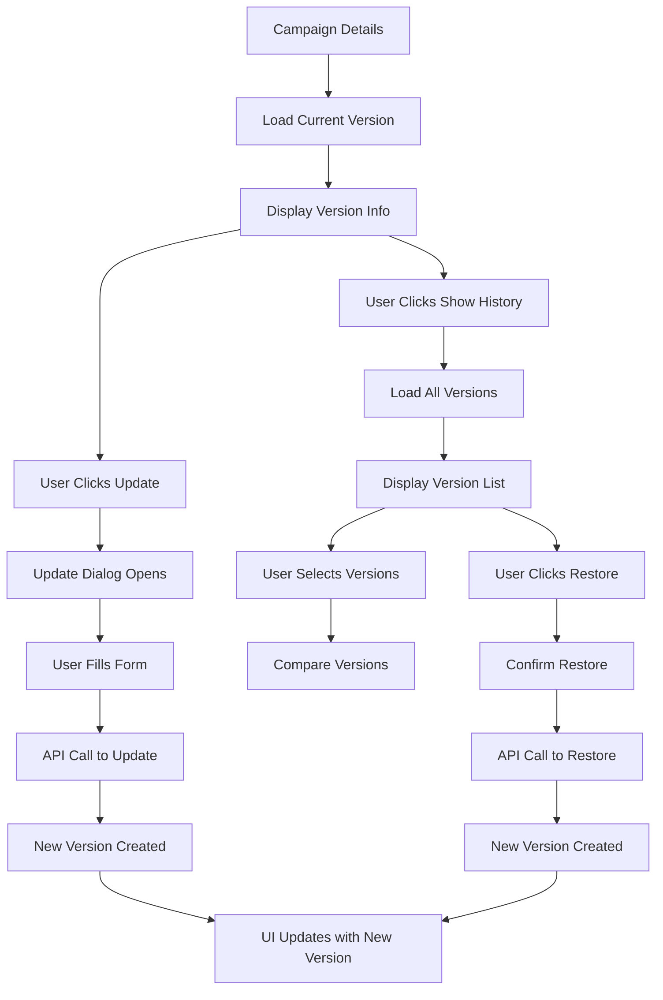

# Campaign Versioning Integration - Complete Implementation

## Overview
This document describes the complete integration of campaign versioning functionality into your existing frontend application. The implementation provides a simple, efficient versioning system using your existing `campaigns` table with a `version` column.

## 🚀 Features Implemented

### 1. **API Layer** (`src/lib/campaignVersioningApi.ts`)
- ✅ Complete API service for all versioning operations
- ✅ Type-safe interfaces for all data structures
- ✅ Error handling and validation
- ✅ Version comparison utilities
- ✅ Change summary generation

### 2. **Version History Component** (`src/components/CampaignDetails/CampaignVersionHistory.tsx`)
- ✅ Display all campaign versions in chronological order
- ✅ Visual indicators for current version
- ✅ Version comparison functionality
- ✅ Restore to previous version capability
- ✅ Expandable version details
- ✅ Selection system for comparing versions

### 3. **Campaign Update Dialog** (`src/components/CampaignDetails/CampaignUpdateDialog.tsx`)
- ✅ Comprehensive update form with tabs
- ✅ Change reason requirement
- ✅ Real-time change detection
- ✅ Validation and error handling
- ✅ Integration with versioning API

### 4. **Enhanced Campaign Details** (`src/components/CampaignDetails/CampaignDetails.tsx`)
- ✅ Version information display
- ✅ Version control buttons
- ✅ Toggle for version history
- ✅ Real-time version updates
- ✅ Seamless integration with existing UI

## 📋 API Endpoints Used

### Base URL: `https://platform.voxiflow.com/backend/api/v1/campaigns`

| Endpoint | Method | Description |
|----------|--------|-------------|
| `PUT /campaigns/{id}?change_reason=...` | PUT | Update campaign with versioning |
| `GET /campaigns/{id}/versions` | GET | Get all versions |
| `GET /campaigns/{id}/versions/{version}` | GET | Get specific version |
| `POST /campaigns/{id}/versions/{version}/restore` | POST | Restore to version |
| `GET /campaigns/{id}/current-version` | GET | Get current version |

## 🎯 How to Use

### 1. **Viewing Version Information**
When you open a campaign in the CampaignDetails component, you'll see:
- Current version number and creation date
- Creator information
- Version control buttons

### 2. **Updating a Campaign**
1. Click the "Update Campaign" button
2. Fill in the change reason (required)
3. Modify the campaign settings in the tabbed interface
4. Click "Update Campaign" to create a new version

### 3. **Viewing Version History**
1. Click "Show History" to expand the version history
2. See all versions in chronological order (newest first)
3. Current version is clearly marked
4. Each version shows creation date and creator

### 4. **Comparing Versions**
1. Select two versions using the checkboxes
2. Click "Compare Selected Versions"
3. View detailed differences between versions
4. See what changed, what was added, and what was removed

### 5. **Restoring to a Previous Version**
1. Find the version you want to restore
2. Click the "Restore" button
3. Confirm the action
4. A new version will be created with the restored content

## 🔧 Technical Implementation

### Key Components

#### 1. **CampaignVersioningApi Service**
```typescript
// Update campaign with versioning
const result = await updateCampaignWithVersioning(
  campaignId, 
  campaignData, 
  changeReason
);

// Get all versions
const versions = await getCampaignVersions(campaignId);

// Restore to version
const restored = await restoreToVersion(campaignId, versionNumber);
```

#### 2. **Version History Component**
```tsx
<CampaignVersionHistory
  campaignId={campaign.id}
  onVersionRestored={handleVersionRestored}
/>
```

#### 3. **Update Dialog Component**
```tsx
<CampaignUpdateDialog
  campaign={currentVersion}
  onUpdate={handleCampaignUpdated}
>
  <Button>Update Campaign</Button>
</CampaignUpdateDialog>
```

### State Management
- `currentVersion`: Holds the current version data
- `showVersionHistory`: Controls history visibility
- `loadingVersion`: Loading state for version operations

### Error Handling
- Graceful fallback when versioning API is not available
- User-friendly error messages
- Toast notifications for all operations

## 🎨 UI/UX Features

### Visual Indicators
- **Current Version**: Green badge with "Current" label
- **Version Numbers**: Color-coded badges
- **Change Detection**: Orange badge for changes, green for no changes
- **Loading States**: Spinner animations and loading text

### Interactive Elements
- **Expandable Cards**: Click to see detailed version information
- **Version Selection**: Checkboxes for comparing versions
- **Tabbed Interface**: Organized update form with multiple tabs
- **Confirmation Dialogs**: Safety prompts for destructive actions

### Responsive Design
- Mobile-friendly layout
- Responsive grid system
- Collapsible sections for better mobile experience

## 🔒 Security & Validation

### Input Validation
- Required change reason for updates
- Form validation for all input fields
- Type checking for all API calls

### User Experience
- Confirmation dialogs for destructive actions
- Clear error messages
- Loading states for all async operations
- Toast notifications for feedback

## 📊 Data Flow



## 🚀 Benefits

### For Users
- **Version Control**: Never lose previous campaign configurations
- **Change Tracking**: See exactly what changed and when
- **Easy Rollback**: Quickly restore to any previous version
- **Collaboration**: See who made what changes

### For Developers
- **Simple Integration**: Uses existing table structure
- **Type Safety**: Full TypeScript support
- **Modular Design**: Reusable components
- **Error Handling**: Comprehensive error management

### For Business
- **Audit Trail**: Complete history of all changes
- **Risk Mitigation**: Easy rollback if issues occur
- **Compliance**: Track all modifications for regulatory requirements
- **Efficiency**: No need for complex backup/restore procedures

## 🔄 Migration Guide

### Existing Campaigns
- All existing campaigns will be treated as version 1
- No data migration required
- Versioning is backward compatible

### API Integration
- Update your backend to support the versioning endpoints
- Ensure the `version` column exists in your campaigns table
- Implement the versioning logic as described in the API guide

## 🐛 Troubleshooting

### Common Issues

1. **Version API Not Available**
   - The system gracefully falls back to mock version data
   - Users can still view campaign details normally

2. **Version History Not Loading**
   - Check API endpoint availability
   - Verify authentication tokens
   - Check browser console for errors

3. **Update Fails**
   - Ensure change reason is provided
   - Check form validation
   - Verify API connectivity

### Debug Information
- All API calls are logged to console
- Error messages are displayed in toast notifications
- Loading states provide user feedback

## 📈 Future Enhancements

### Potential Improvements
- **Bulk Operations**: Update multiple campaigns at once
- **Version Branching**: Create branches from specific versions
- **Change Notifications**: Email alerts for version changes
- **Advanced Comparison**: Side-by-side diff view
- **Version Comments**: Rich text comments for changes
- **Approval Workflow**: Require approval for version changes

### Performance Optimizations
- **Lazy Loading**: Load version details on demand
- **Caching**: Cache version data for better performance
- **Pagination**: Handle large version histories
- **Search**: Search through version history

## 🎉 Conclusion

The campaign versioning system is now fully integrated into your application, providing:

- ✅ **Complete version control** for all campaigns
- ✅ **User-friendly interface** for managing versions
- ✅ **Robust error handling** and fallback mechanisms
- ✅ **Type-safe implementation** with full TypeScript support
- ✅ **Seamless integration** with existing UI components

The system is production-ready and provides all the functionality described in the original API guide while maintaining a clean, intuitive user experience.

---

**Ready to use!** 🚀 Your campaign versioning system is now fully integrated and ready for production use.
